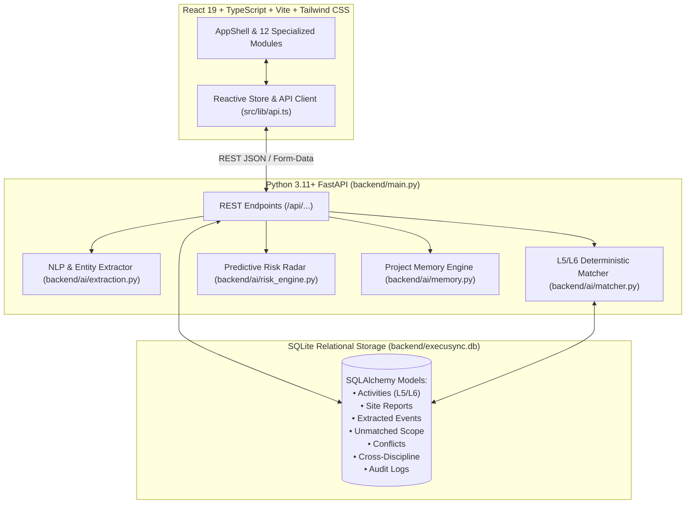

# EXECUSYNC AI — Architecture Specification

## Overview
**EXECUSYNC AI** is an intelligent data capture and schedule-linking platform designed for infrastructure project controls (Oil India Limited SIH 2026).

---

## Architectural Layers

### 1. Presentation Layer (Frontend)
- Built on **React 19**, **TypeScript**, **Vite**, **TanStack Router**, **Tailwind CSS**, and **Lucide Icons**.
- Implements 12 distinct enterprise modules:
  1. Executive Dashboard (Live KPIs, S-Curve chart, Discipline progress)
  2. Live Progress (Discipline velocity, today's event stream)
  3. Schedule Explorer (Multi-filter, search, WBS tree, drawer inspector)
  4. Site Reports Ingestion (PDF, XLSX, CSV, DOCX, TXT drag-and-drop)
  5. AI Match Center (Explainability factor breakdown, candidate ranking)
  6. Supervisor Time Agent (Natural language progress capture)
  7. Unmatched Activity Detector (Scope growth & ghost activity discovery)
  8. Data Conflict Arbitration (Contractor vs. Supervisor discrepancy resolution)
  9. Cross-Discipline Intelligence (Multi-trade handoff bottleneck radar)
  10. Project Memory (Historical benchmark queries & past project lessons)
  11. Early Warning Radar (Predictive schedule slip forecasting)
  12. Audit Trail (Immutable governance log with before/after diffs)

### 2. API & Application Layer (Python FastAPI)
- Framework: **FastAPI** with **Pydantic v2** validation and asynchronous request handlers.
- Endpoints:
  - `GET /api/health`: Health status.
  - `GET /api/dashboard`: Aggregated KPIs, S-Curve points, discipline velocity.
  - `GET /api/activities`: Search and filter L5/L6 work packages.
  - `POST /api/site-reports/upload`: File and synthetic report ingestion.
  - `POST /api/site-reports/process`: Trigger AI NLP extraction and candidate matching.
  - `POST /api/matches/{id}/approve`: Apply actual progress and generate audit logs.
  - `POST /api/time-agent`: Interpret natural language progress updates.
  - `POST /api/conflicts/{id}/resolve`: Arbitrate multi-source report conflicts.
  - `POST /api/project-memory/query`: Query synthetic past project metrics.

### 3. AI & Matching Engine
- **Entity Extraction** (`backend/ai/extraction.py`): Parses discipline, area, equipment tags (`PT-101`, `F-102`, `V-201`), line sizes (`24"`), event type (`START`/`END`/`PROGRESS`), and observed progress.
- **Hybrid Matching Engine** (`backend/ai/matcher.py`):
  $$\text{Confidence} = 20 + 82 \times (0.22 \cdot D + 0.36 \cdot T + 0.30 \cdot S + 0.10 \cdot A + 0.34 \cdot W + C)$$
  where $D = \text{Discipline}$, $T = \text{Equipment Tag}$, $S = \text{Line Size}$, $A = \text{Area}$, $W = \text{Semantic Words}$, $C = \text{Schedule Context}$.
- **Explainability**: Every match yields transparent positive factors ($\checkmark$) and ambiguity warnings ($\triangle$).

### 4. Database Layer (SQLite via SQLAlchemy)
- Single-file zero-dependency database: `backend/execusync.db`.
- Automatically initialized and seeded on first launch with 48 realistic L5/L6 activities for *"Refinery Expansion & Utilities Project"* (`OIL-REF-2026-01`).
