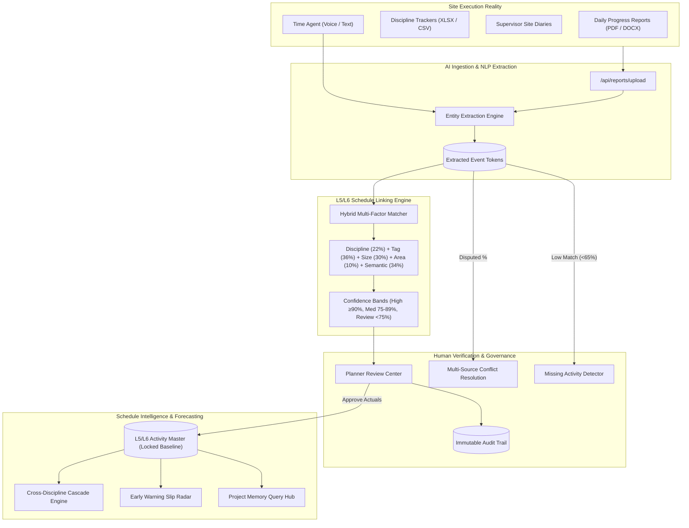

# EXECUSYNC AI
### Planning-to-Execution Intelligence Platform

> **Problem Statement**: Intelligent Data Capture & Schedule-Linking Layer for Infrastructure Project Management: Real-Time Actual Progress Tracking (Planning-to-Execution Bridge)  
> **Target Organization**: Oil India Limited  
> **Competition**: Smart India Hackathon (SIH) Prototype  

---

## 🎯 Executive Summary & Innovation

Traditional infrastructure project management suffers from a fundamental disconnect between two worlds:
1. **Planning World**: Structured Primavera P6 / MS Project schedules (L5/L6 work packages, baseline dates, critical path logic).
2. **Execution World**: Unstructured site reality (Daily Progress Reports, site diaries, contractor claim spreadsheets, supervisor voice/text updates).

**EXECUSYNC AI** bridges this gap through a real-time, deterministic AI extraction and activity-linking engine backed by human-in-the-loop governance.



---

## 🔑 Core Features & Capabilities

1. **Executive Command Center**: Live KPIs, Planned vs. Actual S-Curve (Recharts), discipline progress breakdown, and real-time AI daily briefing.
2. **L5/L6 Schedule Explorer**: Searchable, multi-filtered table of all 48 work packages across 7 disciplines with CSV export and baseline locking.
3. **Data Ingestion Center**: Drag-and-drop file upload supporting PDF, XLSX, CSV, DOCX, and TXT with 1-click synthetic demo report loading.
4. **AI Extraction Laboratory**: Entity parser extracting discipline, equipment tags (e.g. `PT-2401`, `F-102`, `V-201`), line sizes (e.g. `24"`), event type (`START`/`END`/`PROGRESS`), and progress %.
5. **AI Activity Matching Engine**: Deterministic multi-factor scoring algorithm with transparent explainability factors and ambiguity alerts.
6. **Planner Review Center**: Tabbed verification desk for High Confidence ($\ge 90\%$), Medium Confidence ($75-89\%$), and Review Required ($<75\%$) with batch approval.
7. **Supervisor Time Agent**: Web Speech voice input and natural language capture with real-time interpretation preview and confirmation.
8. **Missing Activity Detector**: Identifies unmapped field tasks, counts occurrence frequency, and allows 1-click creation of new L6 schedule activities.
9. **Data Conflict Resolution**: Detects discrepancies between contractor claims (e.g., $100\%$) and supervisor diaries (e.g., $70\%$) with arbitration sliders and audit tracking.
10. **Cross-Discipline Intelligence**: Maps interdependent handoff chains (Civil $\rightarrow$ Piping $\rightarrow$ Mechanical $\rightarrow$ Electrical $\rightarrow$ Instrumentation $\rightarrow$ HSE).
11. **Project Memory**: Natural-language query interface over historical execution benchmarks, average actual durations, and top delay causes.
12. **Early Warning Radar**: Predictive schedule slip indicators with transparent root-cause reasoning.
13. **Schedule Audit Trail**: Immutable governance log with before/after diffs, actor role, timestamp, and source document links.
14. **Reports & Analytics**: 4 downloadable CSV reports (Progress, AI Matching, Unmatched Scope, Conflicts).
15. **Settings & Threshold Tuning**: Interactive sliders for AI confidence bands, AI provider toggle (Demo Deterministic vs. Gemini LLM), and demo reset.

---

## 🏗️ Technology Stack

- **Frontend**: React 19, TypeScript, Vite, TanStack Router, Tailwind CSS, Lucide Icons, Radix UI, Recharts, Sonner.
- **Backend API**: Node.js, TypeScript, Express, Multer, XLSX parsing, tsx runtime.
- **Database & State**: In-memory + persistent file-backed JSON/SQLite database layer.
- **AI Architecture**: Modular `AIProvider` interface with zero-dependency `DemoAIProvider` and optional `GeminiLLMProvider`.

---

## 🚀 Quick Start & Installation

### 1. Prerequisites
- Node.js (v18 or higher)
- npm (v9 or higher)

### 2. Clone & Install Dependencies
```bash
# Navigate to project directory
cd execusync-ai-bridge-main

# Install all dependencies
npm install --legacy-peer-deps
```

### 3. Environment Setup
Copy `.env.example` to `.env`:
```bash
cp .env.example .env
```
Default `.env` settings:
```env
PORT=3001
AI_PROVIDER=demo
DEMO_MODE=true
# Optional: GEMINI_API_KEY=your_key_here
```

### 4. Running the Application

You can start both backend server and frontend concurrently:
```bash
npm run dev:all
```

Or run them individually in separate terminals:
```bash
# Terminal 1: Backend Express API (Port 3001)
npm run server

# Terminal 2: Frontend Client (Port 5173 / 3000)
npm run dev
```

Open your browser at `http://localhost:5173` (or the URL displayed in the terminal).

---

## 🎭 5-Minute SIH Demo Flow

Follow this exact walkthrough during your presentation:

1. **Enter as Project Planner**: On the landing screen, select **Project Planner** role to enter the dashboard.
2. **Review Executive Dashboard**: Point out the live KPIs, S-Curve chart (Planned vs. Actual), and AI Daily Execution Brief.
3. **Data Ingestion**: Navigate to **Data Ingestion Center** $\rightarrow$ click **1-Click Load: Daily Progress Report #028** $\rightarrow$ click **Process AI Matches**.
4. **Inspect AI Match**: In the **Planner Review Center**, observe how `24 inch spool erection started in Area A` was automatically mapped to `PIP-A-0245` with $96\%$ confidence.
5. **Verify Match**: Click **Approve & Update Schedule** $\rightarrow$ notice that `actualStart` is updated while planned baseline remains locked, and an audit record is created.
6. **Supervisor Time Agent**: Navigate to **Time Agent** $\rightarrow$ click on sample chip `"Pump P-101 installation started in Area B"` $\rightarrow$ click **[CONFIRM & RECORD PROGRESS]** to see instant live schedule linking.
7. **Missing Activity Detector**: Navigate to **Missing Activity Detector** $\rightarrow$ observe `"Temporary bypass pipe installed"` with frequency counter $\rightarrow$ click **Create New L6 Activity**.
8. **Resolve Data Conflict**: Open **Data Conflicts** $\rightarrow$ view discrepancy on `PIP-B-0277` (Contractor $100\%$ vs Supervisor $70\%$) $\rightarrow$ click **Arbitrate & Resolve Conflict** $\rightarrow$ set progress to $70\%$ with justification note.
9. **Explore Cross-Discipline Intelligence**: Open **Cross-Discipline** $\rightarrow$ observe the `Civil → Piping → Electrical` cascade alert.
10. **Query Project Memory**: Open **Project Memory** $\rightarrow$ click `"What usually delays pipe erection?"` $\rightarrow$ see instant synthetic benchmark answers.
11. **Check Early Warning Radar**: Open **Early Warning Radar** to review predicted schedule slips with transparent reasoning.
12. **Download Reports**: Open **Reports & Analytics** $\rightarrow$ click **Download CSV** on the Project Progress Report.

---

## 📋 Synthetic Demonstration Notice
*This platform uses synthetic demonstration data generated for the Smart India Hackathon problem statement. It contains no real Oil India Limited confidential information.*
